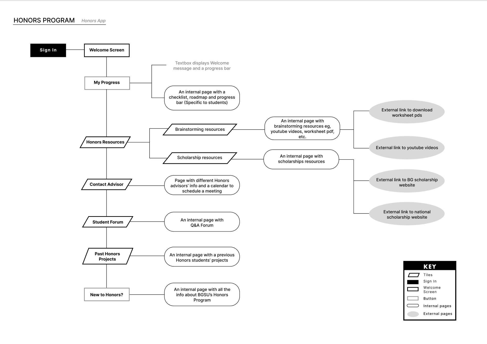

# The Honors Project

link to [figma](https://www.figma.com/proto/SFnE2mUuTMbuHmeD1K64JT/Maddie%2C-Jozlyn%2C-Yusra%2C-Anna?type=design&node-id=3769-951&t=DVMBLV7z4fONGwJ9-1&scaling=scale-down&page-id=3559%253A569&starting-point-node-id=3566%253A591&show-proto-sidebar=1)


Architecture Diagram




## Setup Requirements

### 1. Development Environment
- Install [Flutter](https://docs.flutter.dev/get-started/install)
- Install [Dart](https://dart.dev/get-dart)
- Install an IDE (recommended: [VS Code](https://code.visualstudio.com/) with Flutter extension or [Android Studio](https://developer.android.com/studio))
- Setup Git ([Git installation guide](https://github.com/git-guides/install-git))

### 2. Dependencies
The project uses several key dependencies defined in the `pubspec.yaml` file:
- `flutter/material.dart` - Core Flutter UI components
- `sqflite` - Local database for task management
- `url_launcher` - For launching external URLs
- `flutter_markdown` - Markdown rendering
- `intl` - For date formatting and localization

## Project Structure

### Key Directories and Files
```
lib/
├── homepage/
│   └── homepage.dart          # Main homepage UI
├── static_pages/
│   ├── advisor_guidelines.dart
│   ├── design_thinking.dart
│   ├── past_projects.dart
│   ├── project_overview.dart
│   ├── project_resources.dart
│   ├── scholarship_resources.dart
│   └── student_faq.dart
├── tracking/
│   ├── database_helper.dart   # SQLite database management
│   ├── todo_model.dart       # Data models for tasks
│   └── todo_page.dart        # Task management UI
├── shared/
│   ├── base_screen.dart      # Base screen template
│   └── strings.dart          # App-wide string constants
├── widgets/
│   ├── app_drawer.dart       # Navigation drawer
│   └── expandable_text_button.dart
└── main.dart                 # App entry point
```

### Key Features and Their Locations

1. **Navigation System**
   - Located in `lib/widgets/app_drawer.dart`
   - Uses Flutter's built-in navigation system
   - Routes defined in `lib/main.dart`

2. **Task Management System**
   - Models: `lib/tracking/todo_model.dart`
   - Database: `lib/tracking/database_helper.dart`
   - UI: `lib/tracking/todo_page.dart`

3. **Static Content Pages**
   - Located in `lib/static_pages/`
   - Uses shared components from `lib/shared/`

## Making Changes

### 1. Adding New Pages
1. Create new dart file in appropriate directory
2. Extend `StatelessWidget` or `StatefulWidget`
3. Use `BaseScreen` widget as template
4. Add route in `main.dart`
5. Add navigation in `app_drawer.dart`

Example:
```dart
import '../shared/base_screen.dart';
import 'package:flutter/material.dart';

class NewPage extends StatelessWidget {
  @override
  Widget build(BuildContext context) {
    return BaseScreen(
      bodyContent: SingleChildScrollView(
        child: // Your content here
      ),
    );
  }
}
```

### 2. Modifying Database
1. Increment version number in `database_helper.dart`
2. Add migration in `_onUpgrade` method
3. Update models in `todo_model.dart`

### 3. Updating Strings
- All static strings are in `lib/shared/strings.dart`
- Follow existing pattern for new strings:
```dart
static const String newString = 'Your new string content';
```

## Common Tasks

### Adding New Task Category
1. Open `todo_page.dart`
2. Locate `_populateInitialData` method
3. Add new category following existing pattern:
```dart
int newCategoryId = await db.insertMajorStep(
    MajorStep(name: "New Category Name", tasks: [])
);
```

### Modifying UI Theme
1. Open `main.dart`
2. Locate `ThemeData` widget
3. Modify color scheme or other theme properties

## Testing

1. **Running Tests**
```bash
flutter test
```

2. **Testing on Devices**
```bash
flutter run
```

## Useful Resources

### Flutter Learning
- [Flutter Documentation](https://docs.flutter.dev/)
- [Flutter Cookbook](https://docs.flutter.dev/cookbook)
- [Dart Programming Language Tour](https://dart.dev/guides/language/language-tour)
- [Flutter Widget Catalog](https://docs.flutter.dev/development/ui/widgets)

### Database
- [SQLite in Flutter](https://docs.flutter.dev/cookbook/persistence/sqlite)
- [sqflite Package Documentation](https://pub.dev/packages/sqflite)

### UI/UX Design
- [Material Design Guidelines](https://m3.material.io/)
- [Flutter Material Components](https://docs.flutter.dev/development/ui/widgets/material)

### Version Control
- [Git Basics](https://git-scm.com/book/en/v2/Getting-Started-Git-Basics)
- [GitHub Guides](https://guides.github.com/)

## Troubleshooting

### Common Issues

1. **Build Errors**
   - Run `flutter clean`
   - Run `flutter pub get`
   - Check Flutter version with `flutter --version`

2. **Database Issues**
   - Check database version in `database_helper.dart`
   - Verify migrations in `_onUpgrade` method
   - Debug with print statements in database operations

3. **UI Issues**
   - Use Flutter DevTools for widget inspection
   - Check for overflow errors in debug console
   - Verify screen constraints and responsive design

## Contributing

1. Create a new branch for your changes
2. Make your changes following the project structure
3. Test thoroughly
4. Create detailed pull request with:
   - Description of changes
   - Screenshots if UI changes
   - Any new dependencies added
